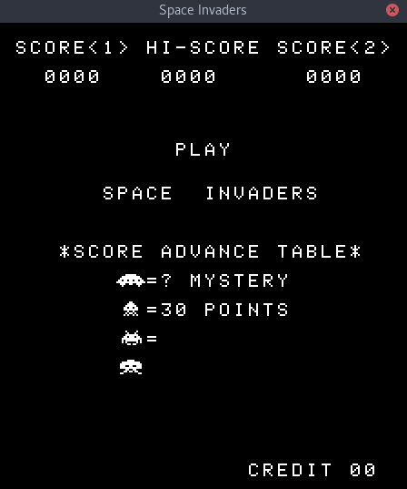
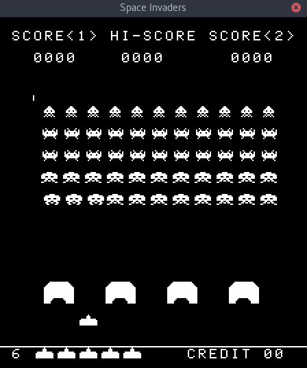
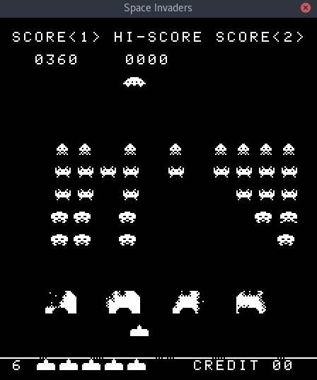

# Space Invaders Emulation
An emulation of the original Space Invaders arcade game.

  

## Details
 - Made with C++
 - Built with CMake
 - Uses a cycle accurate Intel 8080 emulator I wrote 
 - Original controls are mapped to the keyboard
 - Supports all sounds
 - Supports two player mode
 - Dipswitches can be configured
 - Accurately timed interrupts, allowing the game to be played at the same
    speed as the original.

## Keyboard mapping
| Action                | Key         |
|-----------------------|-------------|
| Insert coin           | C           |
| Player one start      | 1           |
| Player one shoot      | Up arrow    |
| Player one move left  | Left arrow  |
| Player one move right | Right arrow |
| Player two start      | 2           |
| Player two shoot      | W           |
| Player two move left  | A           |
| Player two move right | D           |
 
 ## Setup
 Setup is fairly simple, following the usual way of creating an executable with CMake. Run as root.
 1. `git clone https://github.com/BenHenderson09/Space-Invaders-Emulation`
 2. `mkdir -p Space-Invaders-Emulation/build && cd Space-Invaders-Emulation/build`
 3. `cmake .. && make`
 4. `./invaders`
 
 ## Dependencies
 - `Intel8080Emulator`, the emulator I wrote. It can be found [here.](https://github.com/BenHenderson09/Intel-8080-Emulator)
 - `SDL2`, used for audio and graphics.